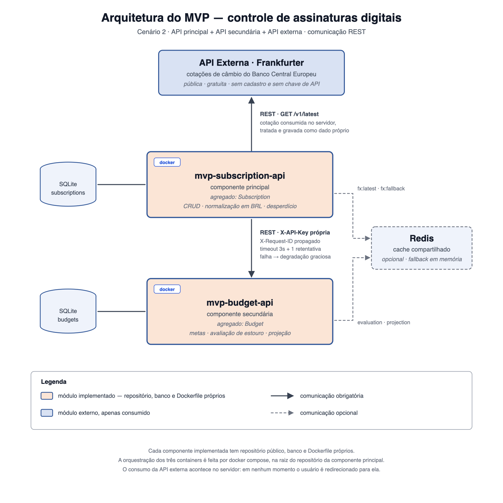
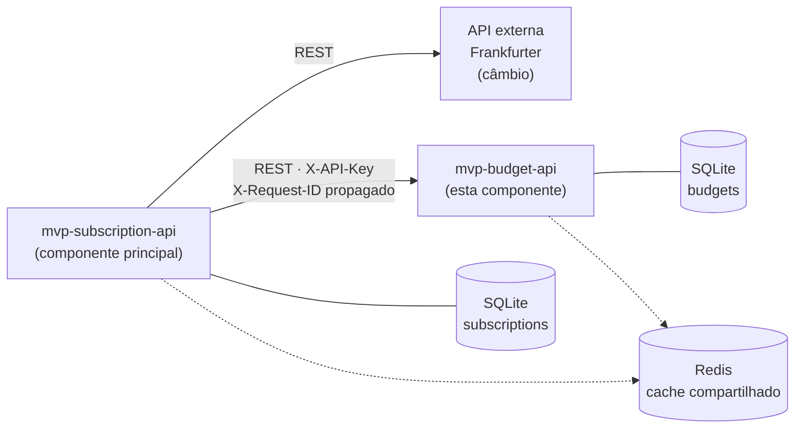

# MVP Budget API

Serviço de **metas de gasto** do MVP de controle de assinaturas digitais, desenvolvido para a
disciplina de **Arquitetura de Software** da PUC-Rio.

É a **componente secundária** da arquitetura: mantém o agregado `Budget` em banco próprio, avalia
o gasto informado pela API principal contra as metas cadastradas e projeta o desembolso dos
próximos meses.

---

## Papel na arquitetura



<details>
<summary>Mesmo diagrama em Mermaid (fonte versionada, renderizada pelo GitHub)</summary>



</details>

A API principal nunca acessa o banco de metas: toda leitura e escrita passa por este serviço.
Se ele estiver indisponível, a principal degrada de forma controlada e continua respondendo sem a
avaliação de metas.

---

## Tecnologias

| Camada | Escolha |
|---|---|
| Linguagem | Python 3.13 |
| Framework | FastAPI (REST + OpenAPI/Swagger) |
| Persistência | SQLite via SQLAlchemy 2 (async, `aiosqlite`) |
| Cache | Redis, com queda automática para cache em memória |
| Testes | pytest + httpx |
| Execução | Docker |

---

## Como executar

### Junto com a componente principal

O MVP completo sobe pelo `docker-compose.yml`, que vive na **raiz do repositório da componente
principal** (`mvp-subscription-api`). Clone os dois repositórios lado a lado e rode o compose de lá:

```bash
cd ../mvp-subscription-api
docker compose up --build
```

Este serviço fica exposto em <http://localhost:8001/docs>.

### Somente esta componente

```bash
docker build -t mvp-budget-api .
docker run --rm -p 8000:8000 -e API_KEY=minha-chave -e SEED_ON_STARTUP=true mvp-budget-api
```

O serviço sobe sozinho, sem depender de Redis nem de nenhum outro container.
Documentação interativa em <http://localhost:8000/docs>.

### Localmente

```bash
python3 -m venv .venv
source .venv/bin/activate
pip install -r requirements-dev.txt
cp .env.example .env
uvicorn app.main:app --reload
```

### Populando dados de demonstração

```bash
python -m seeds.seed
```

O seed é idempotente: rodar de novo não duplica metas.

---

## Variáveis de ambiente

| Variável | Padrão | Descrição |
|---|---|---|
| `API_KEY` | `budget-local-dev-key` | Chave exigida no cabeçalho `X-API-Key`. |
| `DATABASE_URL` | `sqlite+aiosqlite:///./data/budget.db` | Banco do serviço. |
| `REDIS_URL` | *(vazio)* | Se ausente ou inacessível, o cache cai para memória. |
| `CACHE_TTL_SECONDS` | `900` | Validade das respostas cacheadas. |
| `SEED_ON_STARTUP` | `false` | Cria metas sintéticas no start. |
| `LOG_LEVEL` | `INFO` | Nível de log. |

O arquivo `.env` **não** é versionado. Use o `.env.example` como ponto de partida.

---

## Rotas

Todas as rotas de negócio exigem o cabeçalho `X-API-Key`. A rota `/health` é aberta.

| Método | Rota | Descrição |
|---|---|---|
| `POST` | `/api/v1/budgets` | Cria a meta de uma categoria. |
| `GET` | `/api/v1/budgets` | Lista com filtro, ordenação e paginação. |
| `GET` | `/api/v1/budgets/{id}` | Consulta uma meta. |
| `PUT` | `/api/v1/budgets/{id}` | Substitui integralmente uma meta. |
| `DELETE` | `/api/v1/budgets/{id}` | Remove uma meta. |
| `POST` | `/api/v1/evaluations` | Avalia o gasto informado contra as metas. |
| `POST` | `/api/v1/projections` | Projeta o desembolso dos próximos meses. |
| `GET` | `/health` | Saúde do serviço e de suas dependências. |

### Exemplo — avaliação

```bash
curl -X POST http://localhost:8000/api/v1/evaluations \
  -H "Content-Type: application/json" \
  -H "X-API-Key: minha-chave" \
  -d '{
    "reference_month": "2026-09",
    "spending": [
      {"category": "STREAMING", "monthly_amount_brl": 45.90},
      {"category": "SAAS", "monthly_amount_brl": 240.00}
    ]
  }'
```

### Exemplo — projeção

```bash
curl -X POST http://localhost:8000/api/v1/projections \
  -H "Content-Type: application/json" \
  -H "X-API-Key: minha-chave" \
  -d '{
    "months": 12,
    "start_month": "2026-09",
    "subscriptions": [
      {"name": "Streaming Plus", "category": "STREAMING", "amount_brl": 55.90,
       "billing_cycle": "MONTHLY", "next_renewal_on": "2026-09-12"},
      {"name": "Curso Anual", "category": "EDUCATION", "amount_brl": 1200.00,
       "billing_cycle": "YEARLY", "next_renewal_on": "2026-03-15"}
    ]
  }'
```

---

## Regras de negócio

**Classificação de uma categoria** (`usage_pct = gasto / limite × 100`):

| Situação | Status |
|---|---|
| `usage_pct` acima de 100% | `EXCEEDED` |
| `usage_pct` a partir do `alert_threshold_pct` | `ALERT` |
| Demais casos | `OK` |

O status consolidado é o **pior** status individual. Categorias com gasto informado mas sem meta
ativa são devolvidas em `unbudgeted_categories`, nunca silenciadas. Metas inativas não participam
da avaliação.

**Projeção:** cada assinatura é distribuída somente nos meses em que é efetivamente cobrada,
respeitando os ciclos mensal, trimestral e anual. Uma data de renovação anterior à janela é
avançada em ciclos inteiros — um plano anual renovado em março continua caindo em março.

---

## Autenticação

O serviço usa uma chave **própria**, distinta da chave da API de assinaturas. Compartilhar a
mesma rede do `docker compose` não é motivo para compartilhar confiança: se a API principal for
comprometida, a chave daqui não vaza junto. A comparação usa `secrets.compare_digest`.

## Cache

`POST /evaluations` e `POST /projections` são cacheados. A chave da avaliação inclui uma
assinatura do conjunto de metas (quantidade + data da última alteração), de modo que **alterar
qualquer meta invalida automaticamente** as avaliações anteriores. A resposta traz `cached`,
indicando a origem do resultado.

Quando o Redis não está disponível o serviço não falha: cai para um cache em processo e reporta
`degraded` em `/health`, para que a limitação fique visível em vez de silenciosa.

## Testes

```bash
pytest
```

Cobrem CRUD, autenticação, filtro/ordenação/paginação, as três faixas de classificação,
invalidação de cache e a distribuição de cobranças na projeção.

---

## Decisões de projeto

- **Schema criado no start, sem Alembic.** Há uma única tabela e nenhuma evolução de schema
  prevista no escopo deste MVP. Em produção o schema seria versionado com Alembic; aqui, migrações
  seriam cerimônia sem migração real para aplicar, além de um passo a mais para falhar no container.
- **Dinheiro persistido em centavos.** SQLite não tem tipo decimal nativo, e gravar `Numeric` ali
  passa por `float` e perde precisão. O tipo `MoneyType` grava inteiros de centavos: o valor
  continua exato e a ordenação por valor continua correta.
- **Erros no formato Problem Details (RFC 7807).** Toda falha devolve `type`, `title`, `status`,
  `detail` e o `request_id` da requisição, o que torna o erro rastreável entre os dois serviços.
- **Cache com dois backends.** Redis quando existe, memória quando não — para que a exigência de o
  `Dockerfile` executar sozinho não dependa de um container extra estar de pé.

---

## Estrutura

```
app/
├── main.py            # criação da aplicação e ciclo de vida
├── config.py          # settings via variáveis de ambiente
├── database.py        # engine, sessão e criação do schema
├── dependencies.py    # injeção de dependências
├── security.py        # autenticação por API key
├── core/              # enums, cache, erros, correlação, tipos
├── models/            # mapeamento ORM do agregado Budget
├── schemas/           # contratos de entrada e saída
├── repositories/      # acesso a dados
├── routers/           # rotas HTTP
└── services/          # regras de negócio
seeds/                 # dados sintéticos idempotentes
tests/                 # testes automatizados
```

---

## Repositórios do MVP

- Componente principal: `mvp-subscription-api` — é lá que vivem o `docker-compose.yml` e a
  documentação da API externa.
- Componente secundária: este repositório.

## Licença

MIT.
